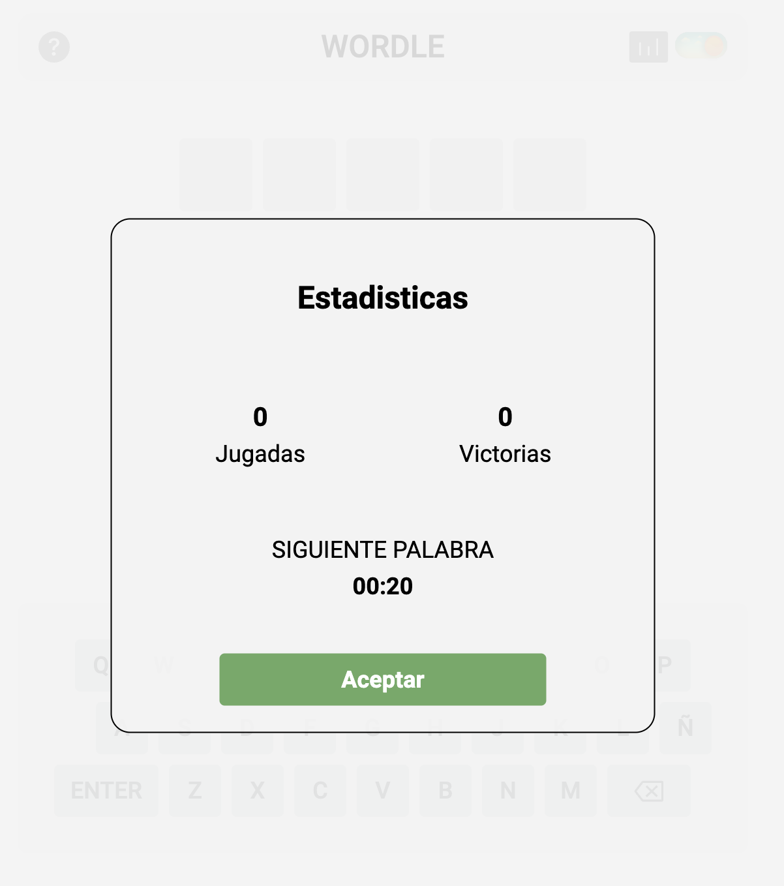
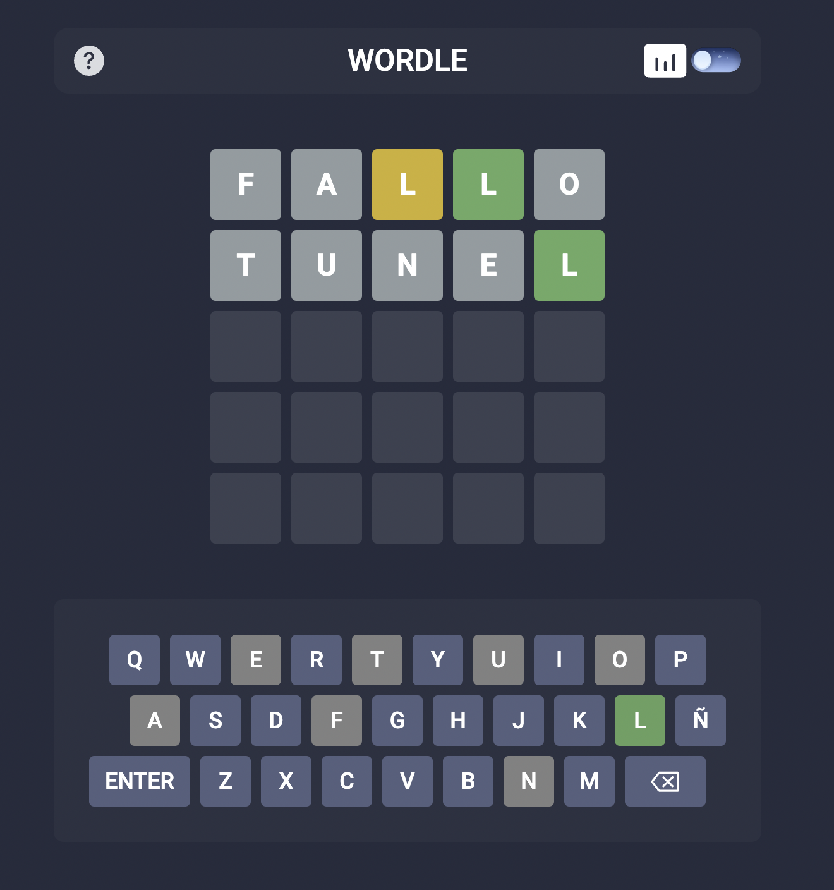

# Wordle Game

Esta App es un wordle, con diseño responsive.
Cuenta con 3 vistas:

### Instrucciones:

### Estadisticas, donde puedes ver las partidas jugadas, ganadas y tiempo restante (5 minutos por partida):

### Pantalla de juego:

### Con el botón ? puedes abrir las instrucciones de nuevo

### Con este botón puedes abrir las estadisticas

### Con este switch puedes alternar la vista entre Dark y Light




#### Link: https://jeferson-daniel-mamian-wordle-game.netlify.app/

### Esta creada con:

- Module Bundler: VITE

- Superset javascript: Typescript

- Framework Javascript: ReactJs

- Preprocesador Css: PostCss

- Framework Css: TailwindCss

- Framework Testing: Vitest

- Libreria de testing: react-testing-library

- Package Manager: Yarn

- Deploy: netlify

### Como ejecutar la app
```
yarn install

yarn dev
```
### Como ejecutar los test
```
yarn test
```
Se desplegará una UI que le ayudará a visualizar los test


### Como ver el coverage del testing:
```
yarn coverage
```
-Go to: tests/coverage

-Open index.html

